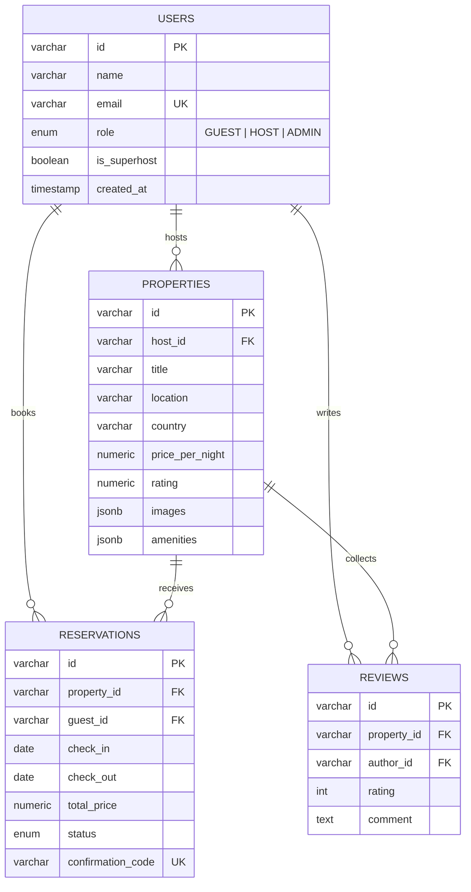

# StayHub — Plataforma de Reservas de Lujo y Alquiler Vacacional Multi-Tenant con RBAC

<div align="center">


**Plataforma Multi-Tenant de alquiler vacacional y gestión de reservas de alta gama (estilo Airbnb Luxury) con control RBAC (Guest / Host / Admin), selector de doble mes, prevención atómica de doble reserva y portal para anfitriones.**

[🚀 Demo en Vivo](https://alxnrocha.github.io/booking-platform/) • [📂 Repositorio en GitHub](https://github.com/alxnrocha/booking-platform)

</div>

---

## 🏛️ Arquitectura y Modelo de Datos



---

## ✨ Características Principales

1. **🎨 Diseño Dark Luxury & Experiencia de Usuario:**
   - Paleta cromática refinada con fondo Dark Slate (`#0A0F1D`), tarjetas con microbordes (`#1E293B`) y acentos en Rose Coral (`#FF385C`), Esmeralda (`#10B981`) y Oro (`#F59E0B`).
   - Contenedores panorámicos (`max-w-[1720px]`) optimizados para pantallas ultra-anchas y dispositivos móviles.

2. **🔍 Barra de Búsqueda Flotante & Selector de Doble Mes (Dual-Month):**
   - Popovers integrados para Destino, Rango de Fechas (dos meses continuos) y contador dinámico de Huéspedes.
   - Conmutador de roles en tiempo real (**Guest Mode**, **Host / Superhost** y **Platform Admin**).

3. **📱 Experiencia Móvil 100% Optimizada (< 520px):**
   - Modal de búsqueda móvil a pantalla completa y barra inferior fija de navegación (*Bottom Nav*).

4. **📸 Página de Detalles & Galería Masonry 5-Fotos:**
   - Cuadrícula fotográfica tipo masonry (1 foto principal + 4 secundarias) con modal lightbox interactivo.

5. **💳 Motor de Reservas & Prevención de Doble Reserva:**
   - Widget flotante con recálculo dinámico de tarifas, validación de fechas ocupadas y generación de voucher estilo *Boarding Pass* con código QR.

6. **📊 Portal del Anfitrión (Host Hub):**
   - Métricas clave (€18.450/mes, 88% ocupación), gráfico de ingresos con Recharts y matriz de disponibilidad con bloqueo de fechas.

---

## 🗂️ Estructura del Proyecto

```text
15-booking-platform/
├── database/
│   ├── schema.sql                     # DDL relacional PostgreSQL 17
│   └── seed.sql                       # Datos determinísticos de demostración
├── prisma/
│   └── schema.prisma                  # Esquema Prisma 6 con modelos e índices
├── src/
│   ├── components/
│   │   ├── booking/                   # BookingConfirmationModal, BookingWidget
│   │   ├── host/                      # AvailabilityCalendar, HostDashboard, RevenueChart
│   │   ├── layout/                    # AppShell, Navbar, Footer, MobileBottomNav
│   │   ├── marketplace/               # CategoryFilterBar, PropertyCard, PropertyGrid
│   │   └── property/                  # PropertyDetailView, PropertyGalleryModal
│   ├── stores/                        # useAuthStore, useBookingStore, useFilterStore
│   ├── types/                         # Tipos TypeScript
│   ├── App.tsx
│   └── main.tsx
├── tests/                             # 25 pruebas unitarias con Vitest
├── compose.yaml                       # Docker Compose PostgreSQL 17
├── package.json
├── tsconfig.json
└── vite.config.ts
```

---

## 🚀 Instalación y Puesta en Marcha

### Prerrequisitos
- Node.js `>= 20.0.0`
- npm `>= 10.0.0`
- Docker & Docker Compose (opcional para PostgreSQL 17)

### Ejecución Local
```bash
# 1. Clonar el repositorio
git clone https://github.com/alxnrocha/booking-platform.git
cd booking-platform

# 2. Instalar dependencias
npm install

# 3. Iniciar contenedor de base de datos (opcional)
docker compose up -d

# 4. Iniciar servidor de desarrollo
npm run dev

# 5. Ejecutar suite de pruebas unitarias (25 tests)
npm test

# 6. Compilar para producción
npm run build
```

---

## 🛠️ Tecnologías Utilizadas

| Capa | Tecnología | Aspectos Clave |
|---|---|---|
| **Framework** | React 19 | RBAC multi-tenant, selector de fechas dual-month |
| **Lenguaje** | TypeScript 5.8 | Tipado estricto para entidades de reserva y propiedades |
| **Base de Datos** | PostgreSQL 17, Prisma 6 | Modelo relacional, índices B-Tree, volúmenes Docker |
| **Estado Global** | Zustand 5.0 | Gestión de sesión RBAC y filtros de búsqueda |
| **Visualización** | Recharts 2.15 | Curvas de ingresos de anfitrión y ocupación |
| **Testing** | Vitest | 25 pruebas unitarias de precios y colisiones |
| **Despliegue** | GitHub Pages | Despliegue estático continuo y optimizado |

---

<div align="center">
  <sub>Desarrollado con dedicación por <a href="https://github.com/alxnrocha">Alex Rocha</a> • Proyecto 15 del Portafolio Profesional Frontend.</sub>
</div>
