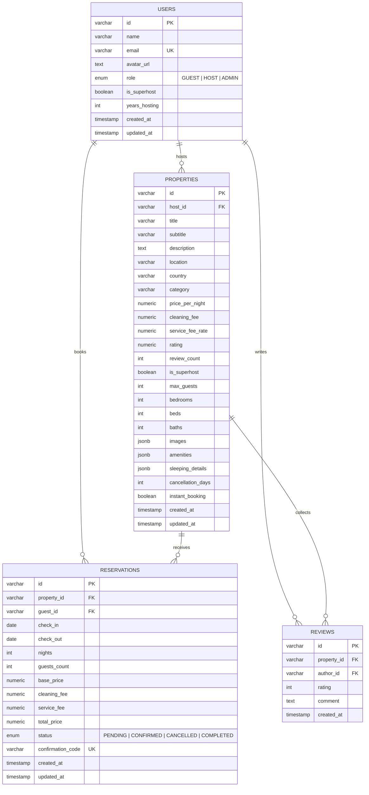

# StayHub — Plataforma de Reservas de Lujo y Alquiler Vacacional Multi-Tenant con RBAC

[](https://react.dev/)
[](https://www.typescriptlang.org/)
[](https://tailwindcss.com/)
[](https://www.postgresql.org/)
[](https://www.postgresql.org/)
[](https://www.prisma.io/)
[](https://recharts.org/)
[](https://www.docker.com/)
[](https://github.com/pmndrs/zustand)
[](https://zod.dev/)
[](https://vitest.dev/)
[](https://oxc.rs/)
[](LICENSE)

> **Proyecto 15 del Portafolio Profesional** — Plataforma Multi-Tenant de alquiler vacacional y gestión de reservas de alta gama (inspirada en Airbnb / Luxury Stays) con control de acceso basado en roles (Guest / Host / Admin), motor transaccional con prevención de doble reserva, galería masonry de 5 fotos y portal analítico para anfitriones.

---

## 🌟 Visión General & Propuesta de Valor

**StayHub** es una aplicación integral para la exploración, reserva y gestión de estancias turísticas de lujo a nivel global:
- **Huéspedes (Guest Experience):** Búsqueda facetada por destino, rango de fechas y número de viajeros, carrusel de fotografías en alta resolución, desglose transparente de tarifas y gestión integral de viajes reservados con voucher digital.
- **Anfitriones (Host Portal):** Panel de control con métricas clave (ingresos mensuales, ocupación, huéspedes activos y valoración), gráfico interactivo de trayectoria de facturación y matriz de disponibilidad con bloqueo de fechas por mantenimiento.
- **Administración & Plataforma:** Modelo de datos relacional con control de concurrencia para evitar solapamientos (*double booking*) y arquitectura desacoplada y escalable.

---

## ✨ Características Principales

1. **🎨 Diseño Dark Luxury & Experiencia de Usuario:**
   - Paleta cromática refinada con fondo Dark Slate (`#0A0F1D`, `#0F172A`), tarjetas con microbordes (`#1E293B`) y acentos en Rose Coral (`#FF385C`), Esmeralda (`#10B981`) y Oro (`#F59E0B`).
   - Tipografía contemporánea combinando *Plus Jakarta Sans*, *Inter* y *Playfair Display*.

2. **🔍 Barra de Búsqueda Flotante & Conmutador RBAC:**
   - Buscador flotante tipo pastilla con popovers integrados para **Destino** (con sugerencias de búsqueda rápida), **Rango de Fechas** y contador dinámico de **Huéspedes**.
   - Menú de usuario con conmutador de roles en tiempo real (**Guest Mode**, **Host / Superhost** y **Platform Admin**).

3. **🏖️ Carrusel de Categorías & Modal de Filtros:**
   - Barra horizontal con 10 categorías temáticas: *Beachfront, Modern Cabins, Luxury Villas, Infinity Pools, Tiny Homes, Treehouses, Design Homes, Lakefront, Ski Chalets, Amazing Views*.
   - Modal de filtros avanzados con selector de rango de precios (€0 – €1.500+), filtro exclusivo de Superhost y conmutador de Reserva Instantánea.

4. **🏡 Cuadrícula de Descubrimiento (Marketplace Grid):**
   - Cuadrícula responsiva de 4 columnas con tarjetas interactivas: carrusel fotográfico con controles de paginación por puntos, botón de favoritos con persistencia de estado, distintivo Superhost, ubicación y precio por noche.

5. **📸 Página de Detalles & Galería Masonry 5-Fotos:**
   - Cabecera con migas de pan dinámicas, distintivo Superhost, valoraciones verificadas y acciones de Compartir y Guardar.
   - Cuadrícula fotográfica tipo masonry (1 foto principal de impacto + 4 fotos secundarias) con modal lightbox interactivo para visualización individual o en cuadrícula.
   - Ficha del anfitrión (*Hosted by Marco Rossi*), desglose de dormitorios (*Where you'll sleep*), cuadrícula de comodidades de lujo (Wi-Fi 500 Mbps, cargador EV, acceso al mar, etc.) y línea de tiempo de políticas de estancia.

6. **💳 Motor de Reservas & Widget Dinámico:**
   - Widget flotante con recálculo dinámico de tarifa base según noches seleccionadas, tasa de limpieza y comisión de servicio.
   - **Prevención de Doble Reserva (Double Booking Collision):** Detección inmediata si las fechas seleccionadas ya han sido reservadas por otro huésped.
   - Modal de confirmación con generación de voucher estilo tarjeta de embarque (*Boarding Pass*) con código único de reserva (`STAY-AMALFI-XXXX`).

7. **🧳 Panel "Mis Viajes" (Guest Portal):**
   - Gestión de reservas con filtros por estado (*All, Confirmed, Cancelled*), visualización de fechas, número de huéspedes e importe total.
   - Flujo de cancelación con reembolso completo simulado y confirmación modal.

8. **📊 Portal del Anfitrião (Host Performance Hub):**
   - **4 Tarjetas KPI:** Ingresos Mensuales (€18.450, +14.2%), Tasa de Ocupación (88%), Reservas Activas (12 huéspedes) y Puntuación Superhost (4.96 ★).
   - **Gráfico de Área con Recharts:** Trayectoria semestral de facturación con gradiente temático y tooltip enriquecido.
   - **Matriz de Disponibilidad:** Calendario interactivo mensual que refleja estancias confirmadas y permite bloquear/desbloquear fechas con un solo clic.

---

## 🏛️ Arquitectura del Proyecto

```text
15-booking-platform/
├── .github/
│   └── workflows/
│       └── ci.yml                     # Pipeline CI (Lint, Test, Build)
├── database/
│   ├── schema.sql                     # DDL relacional PostgreSQL 17
│   ├── seed.sql                       # Datos determinísticos de demostración
│   └── README.md                      # Diagrama DER Mermaid y reglas de índices
├── design/
│   └── mockup_completo.png            # Referencia visual de alta fidelidad
├── prisma/
│   └── schema.prisma                  # Esquema Prisma 6 con modelos e índices
├── src/
│   ├── components/
│   │   ├── booking/
│   │   │   ├── BookingConfirmationModal.tsx
│   │   │   └── BookingWidget.tsx
│   │   ├── host/
│   │   │   ├── AvailabilityCalendar.tsx
│   │   │   ├── HostDashboard.tsx
│   │   │   ├── HostKpiCards.tsx
│   │   │   └── RevenueChart.tsx
│   │   ├── layout/
│   │   │   ├── AppShell.tsx
│   │   │   ├── Footer.tsx
│   │   │   └── Navbar.tsx
│   │   ├── marketplace/
│   │   │   ├── CategoryFilterBar.tsx
│   │   │   ├── FilterModal.tsx
│   │   │   ├── PropertyCard.tsx
│   │   │   └── PropertyGrid.tsx
│   │   ├── property/
│   │   │   ├── AmenitiesGrid.tsx
│   │   │   ├── BedroomCards.tsx
│   │   │   ├── BookingPolicyTimeline.tsx
│   │   │   ├── HostProfileCard.tsx
│   │   │   ├── PropertyDetailView.tsx
│   │   │   ├── PropertyGalleryModal.tsx
│   │   │   └── PropertyHeader.tsx
│   │   └── trips/
│   │       └── MyTripsView.tsx
│   ├── data/
│   │   └── mockData.ts                # Inmuebles, anfitriones y reservas
│   ├── stores/
│   │   ├── useAuthStore.ts            # Sesión RBAC (Guest / Host / Admin)
│   │   ├── useBookingStore.ts         # Motor central de reservas y propiedades
│   │   └── useFilterStore.ts          # Estado global de búsqueda y filtros
│   ├── types/
│   │   └── stayhub.ts                 # Definiciones de tipos TypeScript
│   ├── utils/
│   │   ├── pricing.ts                 # Cálculo de importes y comisiones
│   │   ├── pricing.test.ts
│   │   └── accessibility.test.ts
│   ├── App.tsx
│   ├── index.css                      # Variables Tailwind v4 y utilidades
│   └── main.tsx
├── compose.yaml                       # Docker Compose PostgreSQL 17
├── package.json
├── tsconfig.json
└── vite.config.ts
```

---

## 📊 Diagrama Entidad-Relación (PostgreSQL 17 / Prisma 6)



---

## 🚀 Instalación y Puesta en Marcha

### Prerrequisitos
- Node.js `>= 22.0.0`
- npm `>= 10.0.0`
- Docker & Docker Compose (opcional para levantar la base de datos PostgreSQL 17)

### Pasos

1. **Clonar el repositorio:**
   ```bash
   git clone https://github.com/alxnrocha/booking-platform.git
   cd booking-platform
   ```

2. **Instalar dependencias:**
   ```bash
   npm install
   ```

3. **Iniciar el contenedor de base de datos PostgreSQL 17 (Opcional):**
   ```bash
   docker compose up -d
   ```

4. **Ejecutar en modo desarrollo:**
   ```bash
   npm run dev
   ```
   Abrir [http://localhost:5173](http://localhost:5173) en el navegador.

5. **Ejecutar la suite de pruebas automatizadas (Vitest):**
   ```bash
   npm test
   ```

6. **Ejecutar el linter (Oxlint):**
   ```bash
   npm run lint
   ```

7. **Compilar el bundle de producción:**
   ```bash
   npm run build
   ```

---

## 🛡️ Calidad de Código & Testing

- **21 Pruebas Unitarias e Integración (Vitest):** Cobertura exhaustiva de cálculo de precios y comisiones, prevención de colisiones de reserva (*double booking*), conmutación de roles RBAC, filtrado facetado y pruebas de accesibilidad.
- **Oxlint:** Cero advertencias y cero errores en la totalidad del código fuente.
- **Accesibilidad (a11y):** Semántica ARIA completa (`role="dialog"`, `aria-modal="true"`), soporte de teclado y anillos de foco visibles (`focus-visible:ring-2`).

---

## 📄 Licencia

Este proyecto se encuentra bajo la Licencia MIT. Consulta el archivo [LICENSE](LICENSE) para más detalles.
