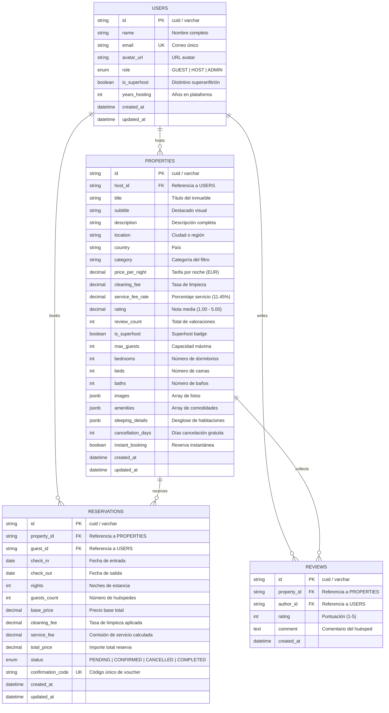

# Modelo de Datos Relacional — StayHub Platform

Documentación técnica del modelo relacional implementado en **PostgreSQL 17** y **Prisma 6**.

---

## 📊 Diagrama Entidad-Relación (Mermaid ERD)



---

## 🛡️ Reglas de Concurrencia e Índices

1. **Prevención de Doble Reserva (Double Booking):**
   - Índice compuesto en `reservations(property_id, check_in, check_out)`.
   - Consulta transaccional que valida no solapamiento:
   ```sql
   SELECT COUNT(*) FROM reservations 
   WHERE property_id = $1 
     AND status = 'CONFIRMED'
     AND NOT (check_out <= $checkIn OR check_in >= $checkOut);
   ```

2. **Búsquedas de Alto Rendimiento:**
   - Índice en `properties(category)` para filtros de carrusel.
   - Índice en `properties(location)` para barra de búsqueda de destino.
